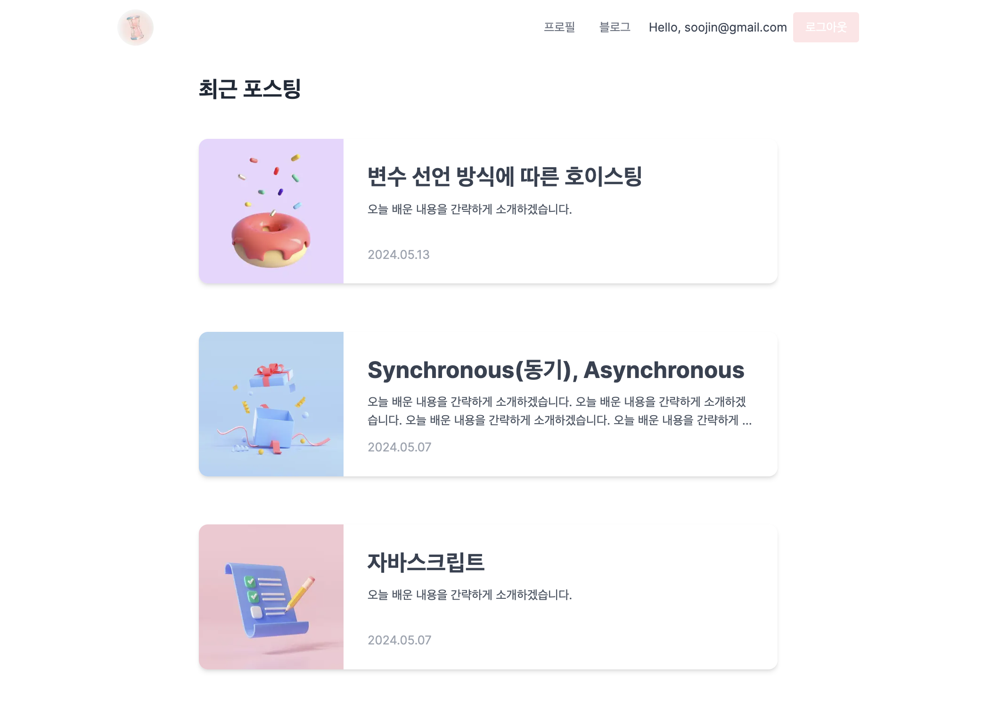

# 수야 기술 블로그

개발 관련하여 새로 알게 된 내용을 정리하고 공유하는 블로그 형식의 프로젝트

배포 링크: https://www.sooya.dev

## 설치 및 사용법

프로젝트를 로컬에서 실행하기 위해선 다음 스텝을 따라주세요.

1. 레포지토리 클론 `git clone https://github.com/soojjung/blog`
2. 터미널에 `npm install` 입력하여 dependencies 설치
3. root directory에 `.env.local` 파일 생성 후 `.env`와 동일한 변수들 세팅
4. [http://localhost:3000](http://localhost:3000) 을 브라우저에서 열어줍니다.

## **주요 특징**

- Next-auth 회원인증기능을 활용한 소셜로그인, 로그인, 회원가입 구현
- Next.js의 File-based Routing(app 폴더)과 Built-in API Routes
- MongoDB(w/Mongoose)를 사용하여 블로그 글 CRUD 기능
- Tailwind CSS로 반응형 UI 구현
- 노션 스타일의 Tiptap 웹 에디터로 블로그 글 작성

## 사용한 스택

- React
- TypeScript
- Next.js
- Next-auth
- MongoDB (w/Mongoose)
- Tailwind CSS
- Vercel

## **Contributing**

버그나 결함이 있을 수 있습니다! 버그 발견시 issue에 달아주시면 반영하도록 하겠습니다! 감사합니다 🙂
